# 4. Побудова знаків та їхніх елементів

## 4.1 Модуль

4.1.1 Модуль (x) — штучний коефіцієнт, що дорівнює ширині штриха літери. Розмір усіх елементів будується залежно від величини модуля, а сам модуль залежить від швидкості на ділянці: це дозволяє зберігати однакові пропорції елементів, навіть коли розміри знаків у населеному пункті менші за розмір на дорозі.

Розмір літер — така ж похідна від загального модуля (ширини штриха). Пропорції шрифту розроблені таким чином, щоб висота рядкової літери основного напису (українського) дорівнювала 4х. Розмір рядкової літери другорядного напису (транслітерації або перекладу) відрізняється на один модуль — 3х, що дозволяє створити достатній контраст до основного напису, але лишати текст читабельним.

4.1.2 Розмір модулів залежить від швидкісного режиму: що більша швидкість, то більший модуль. Значення модулів для рядкових літер (xh) та для великих/прописних (Ch) літер наведені в таблиці 4.1.

Таблиця 4.1 — Розміри модулів для різних типів доріг

<table style="vertical-align: top;">
  <tr>
   <td rowspan="3" ><strong>Швидкість руху</strong>
   </td>
   <td colspan="8" ><strong>Розташування знака</strong>
   </td>
  </tr>
  <tr>
   <td colspan="4" ><strong>Збоку від дороги</strong>
   </td>
   <td colspan="4" ><strong>Над дорогою</strong>
   </td>
  </tr>
  <tr>
   <td>Модуль (x), мм
   </td>
   <td>Рядкова літера (xh), мм
   </td>
   <td>Велика літера (Ch), мм
   </td>
   <td>Розмір шрифту, pt
   </td>
   <td>Модуль (x), мм
   </td>
   <td>Рядкова літера, мм
   </td>
   <td>Велика літера, мм
   </td>
   <td>Розмір шрифту, pt
   </td>
  </tr>
  <tr>
   <td>50 км/год
   </td>
   <td><strong>30</strong>
   </td>
   <td>120
   </td>
   <td>168
   </td>
   <td>67,5
   </td>
   <td><strong>40</strong>
   </td>
   <td>160
   </td>
   <td>224
   </td>
   <td>90
   </td>
  </tr>
  <tr>
   <td>90
   </td>
   <td><strong>40</strong>
   </td>
   <td>160
   </td>
   <td>224
   </td>
   <td>90
   </td>
   <td><strong>50</strong>
   </td>
   <td>200
   </td>
   <td>280
   </td>
   <td>112,5
   </td>
  </tr>
  <tr>
   <td>110
   </td>
   <td><strong>60</strong>
   </td>
   <td>240
   </td>
   <td>336
   </td>
   <td>135
   </td>
   <td><strong>70</strong>
   </td>
   <td>280
   </td>
   <td>392
   </td>
   <td>157,5
   </td>
  </tr>
  <tr>
   <td>130
   </td>
   <td><strong>80</strong>
   </td>
   <td>320
   </td>
   <td>448
   </td>
   <td>180
   </td>
   <td><strong>90</strong>
   </td>
   <td>360
   </td>
   <td>504
   </td>
   <td>202,5
   </td>
  </tr>
</table>

, велика/прописна літера (Ch) та кегельний майданчик (pt)")

Ілюстрація 4.1 — Рядкова літера (xh), велика/прописна літера (Ch) та кегельний майданчик (pt)

Відштовхуємось від розмірів рядковими літерами, оскільки їх більшість. Застосовуємо коефіцієнт (kчит) — 10 мм літери на кожні 4,8 м відстані, з якої потрібно зчитувати знак. За різної швидкості відстань зчитування (D) буде різною та вираховується з висоти  з урахуванням коефіцієнту:

D = Ch * kчит / 10

kчит = 4,8

Для швидкісної дороги та швидкості 90 км/год, якщо використати модуль 40 мм, отримуємо зчитування знака зі 108 метрів.

Беремо в розрахунок, що ми розташовуємо на одному знаку не більше трьох населених пунктів чи об’єктів (окрім схем 5.51), а разом із транслітом це не більше шести рядків тексту, то на зчитування потрібно від 4 до 6 секунд. Порахувавши час сприйняття текстів з різним модулем (таблиця 4.1.2) вивели величини, які варто використовувати на ДЗІП.

Варто прив’язуватись саме до швидкісного режиму, а не до категорії дороги, оскільки саме швидкість руху найбільше впливає на читабельність тексту. Це також впливає на безпеку: якщо дорога категорії  1-б, то за межами міста допустима швидкість — 110 км/год, але в межах населеного пункту швидкість має знижуватись до 50 км/год. І тоді у водія немає потреби зчитувати знаки так, як при 110 км/год, тож в межах міста можна робити знаки меншими, часто вони будуть менших габаритів і їх простіше буде розміщувати на території міста.

Таблиця 4.1.2 — Час сприйняття тексту різних модулів з різною швидкістю

<!-- 
| Швидкість   | Час сприйняття, с |   |   |   |   |   |
| ---         | ---    | ---     | ---    | ---    | ---    | ---    |
|             | x = 30 |  x = 40 | x = 50 | x = 60 | x = 70 | x = 80 |
| 50 км/год   | 5,80   | 7,74    | 9,67   | 11,60  | 13,54  | 15,47  |
| 90 км/год   | 3,22   | 4,30    | 5,37   | 6,45   | 7,52   | 8,59   |
| 110 км/год  | 2,64   | 3,52    | 4,40   | 5,27   | 6,15   | 7,03   |
| 130 км/год  | 2,23   | 2,98    | 3,72   | 4,46   | 5,21   | 5,95   |
 -->

<table>
  <tr style="font-weight: bold; vertical-align: top;">
   <td rowspan="2"  width="130">Швидкість
   </td>
   <td colspan="6" >Час сприйняття, с
   </td>
  </tr>
  <tr>
   <td>x=30
   </td>
   <td>x=40
   </td>
   <td>x=50
   </td>
   <td>x=60
   </td>
   <td>x=70
   </td>
   <td>x=80
   </td>
  </tr>
  <tr>
   <td>50 км/год
   </td>
   <td>5,80
   </td>
   <td>7,74
   </td>
   <td>9,67
   </td>
   <td>11,60
   </td>
   <td>13,54
   </td>
   <td>15,47
   </td>
  </tr>
  <tr>
   <td>90 км/год
   </td>
   <td>3,22
   </td>
   <td>4,30
   </td>
   <td>5,37
   </td>
   <td>6,45
   </td>
   <td>7,52
   </td>
   <td>8,59
   </td>
  </tr>
  <tr>
   <td>110 км/год
   </td>
   <td>2,64
   </td>
   <td>3,52
   </td>
   <td>4,40
   </td>
   <td>5,27
   </td>
   <td>6,15
   </td>
   <td>7,03
   </td>
  </tr>
  <tr>
   <td>130 км/год
   </td>
   <td>2,23
   </td>
   <td>2,98
   </td>
   <td>3,72
   </td>
   <td>4,46
   </td>
   <td>5,21
   </td>
   <td>5,95
   </td>
  </tr>
</table>

## 4.2 Загальні принципи дизайну знаків

4.2.1 Принцип близькості — об’єкти, розташовані поруч, сприймаються зв’язаними за сенсом між собою.

Правило внутрішнього і зовнішнього — окремий випадок теорії близькості. Типографічний об’єкт будь-якого рівня складається з інших об’єктів: літери зі штрихів, слова з літер, рядки зі слів, абзаци з рядків. І для того щоб об’єкт мав самостійне значення, тобто щоб літера, слово, рядок та абзац відділились від сусідніх, його внутрішні відстані мають бути меншими за зовнішні.

4.2.2 Виділення пріоритетів. Дизайн — це спосіб керування увагою водія, особливо в умовах малого часу сприйняття знака в різних умовах видимості. Тому в дизайні потрібно виділяти пріоритети і таким чином спрощувати сприйняття знаків.

4.2.3 Розміри знаків підлаштовуються під інформацію. Розміри знаків підлаштовуються під інформацію на знаку, а не навпаки, оскільки розмір тексту та інформації розраховано для найкращої зчитуваності на швидкості.

4.2.4 Лінія читання. Окрім модульної сітки для кращої естетики і покращення сприйняття, створюємо лінію читання «Назва—Відстань—Напрям». Об’єкти на одній лінії простіше співвідносити між собою.

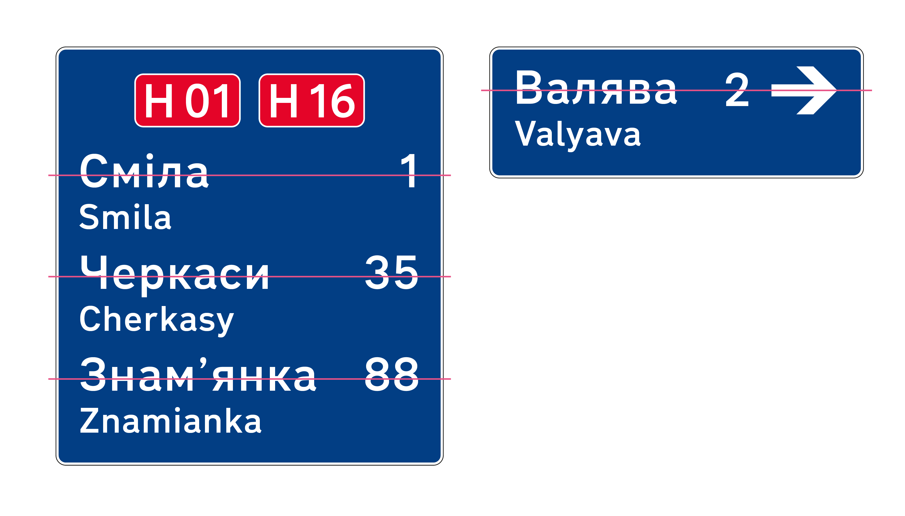

Ілюстрація 4.2 — Лінії читання на знаках підтвердження та напрямку руху

4.2.5 Заокруглення. Замість стандартного механічного заокруглення, в основі якого лежить еліпс, потрібно використовувати криву, в основі якої лежить супереліпс (крива Ламе), що дає більш плавний та природній згин кривої.

")

Ілюстрація 4.3 — Порівняння механічного радіусу з еліпсу та кривої з суперліпсу (кривої Ламе)

## 4.3 Шрифт

4.3.1 Для всіх написів використовується шрифт [Road UA](https://github.com/agentyzmin/Road-UA-Font/releases/download/1/Road.UA.v.1.zip). 

Для знаків використовуються два основних накреслення (ілюстрація 4.4): 
* Medium (середній) — для написів на темному (синьому, зеленому, червоному) тлі;
* Bold (жирний) — для написів на білому та жовтому тлі.

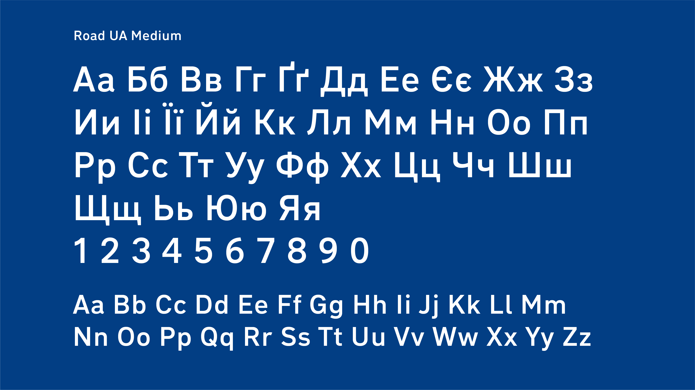
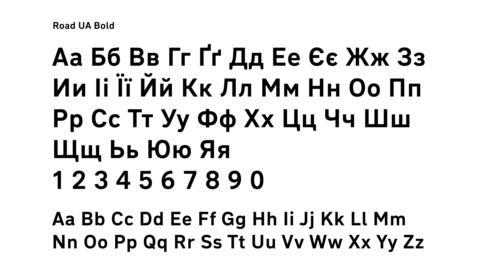

Ілюстрація 4.4 — Літери шрифту Road UA в накресленнях medium та bold

4.3.2 Для всіх написів використовуємо написання Title сase (ілюстрація 4.5) — великі літери використовують для початку повідомлення та початку кожного слова у власних назвах, інші літери рядкові.

Ілюстрація 4.5 — Написання Title case

4.3.3 Крім літер у шрифті присутні піктограми кодів країн та піктограми, які доступні у разі застосування лігатур (opentype feature) або як окремі символи.

## 4.4 Мови 

4.4.1 Основна мова знаків — українська. Додатково до української використовується:
* транслітерація — для власних назв, коли треба передати точне звучання назви латинськими літерами (назви топонімів — назви населених пунктів, річок, вулиць тощо);
* переклад англійською — для інформаційних повідомлень, коли треба передати осмислений зміст.

4.4.2 Завжди використовуються два написи один під одним: спочатку українська, потім трансліт/переклад. Це дозволяє зробити інформацію передбачуваною: водій завжди очікуватиме побачити необхідні написи і зможе швидше їх розпізнавати (ілюстрація 4.6).

4.4.3 Не можна розділяти українські і транслітеровані/перекладені написи на різні знаки, це руйнує передбачуваність зчитування (ілюстрація 4.7).

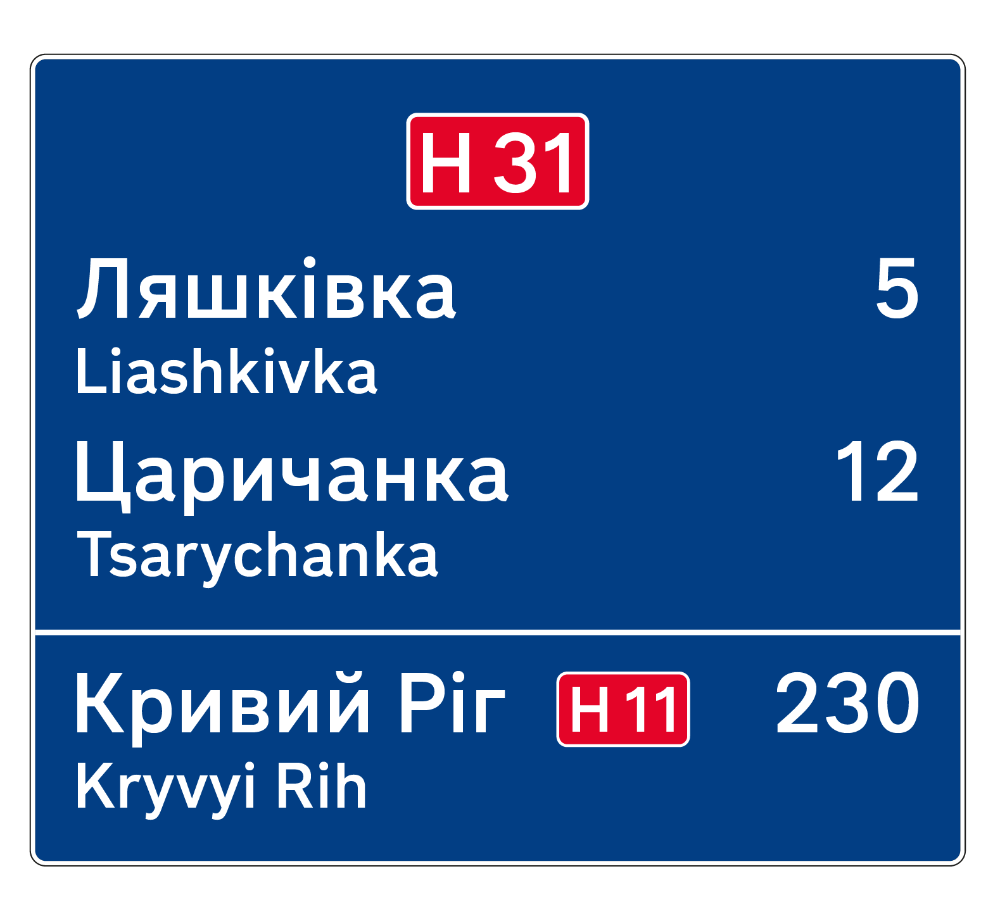

Ілюстрація 4.6 — Розташування написів один під одним

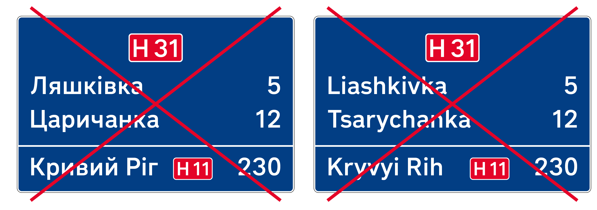

Ілюстрація 4.7 — Неправильне розташування написів різною абеткою

4.4.4 Для транслітерованих назв використовується модифікована паспортна транслітерація КМУ 2010. Від офіційної паспортної транслітерації вона відрізняється спрощеною літерою «щ» — «sch», а також усуненим дублюванням у «iie», «iia», «zhg», «ts», а «ьо» транслітерується як «io» (таблиця 4.2).

Таблиця 4.2 — Відповідники транслітерації

<table>
  <tr>
   <td>А
   </td>
   <td>a
   </td>
   <td>Й
   </td>
   <td>i, y *
   </td>
   <td>Ц
   </td>
   <td>ts
   </td>
  </tr>
  <tr>
   <td>Б
   </td>
   <td>b
   </td>
   <td>К
   </td>
   <td>k
   </td>
   <td>Ч
   </td>
   <td>ch
   </td>
  </tr>
  <tr>
   <td>В
   </td>
   <td>v
   </td>
   <td>Л
   </td>
   <td>l
   </td>
   <td>Ш
   </td>
   <td>sh
   </td>
  </tr>
  <tr>
   <td>Г
   </td>
   <td>h, gh **
   </td>
   <td>М
   </td>
   <td>m
   </td>
   <td>Щ
   </td>
   <td>sch
   </td>
  </tr>
  <tr>
   <td>Ґ
   </td>
   <td>g
   </td>
   <td>Н
   </td>
   <td>n
   </td>
   <td>Ь
   </td>
   <td>не транслітерується
   </td>
  </tr>
  <tr>
   <td>Д
   </td>
   <td>d
   </td>
   <td>О
   </td>
   <td>o
   </td>
   <td>Ю
   </td>
   <td>iu, yu *
   </td>
  </tr>
  <tr>
   <td>Е
   </td>
   <td>e
   </td>
   <td>П
   </td>
   <td>p
   </td>
   <td>Я
   </td>
   <td>ia, ya *
   </td>
  </tr>
  <tr>
   <td>Є
   </td>
   <td>ie, ye *
   </td>
   <td>Р
   </td>
   <td>r
   </td>
   <td>’
   </td>
   <td>не транслітерується
   </td>
  </tr>
  <tr>
   <td>Ж
   </td>
   <td>zh
   </td>
   <td>С
   </td>
   <td>s
   </td>
   <td>Іє, іє
   </td>
   <td>Ie, ie
   </td>
  </tr>
  <tr>
   <td>З
   </td>
   <td>z
   </td>
   <td>Т
   </td>
   <td>t
   </td>
   <td>Ія, ія
   </td>
   <td>ia 
   </td>
  </tr>
  <tr>
   <td>И
   </td>
   <td>y
   </td>
   <td>У
   </td>
   <td>u
   </td>
   <td>Зг, зг
   </td>
   <td>Zgh, zgh
   </td>
  </tr>
  <tr>
   <td>І
   </td>
   <td>i
   </td>
   <td>Ф
   </td>
   <td>f
   </td>
   <td>ьо
   </td>
   <td>io
   </td>
  </tr>
  <tr>
   <td>Ї
   </td>
   <td>i, yi *
   </td>
   <td>Х
   </td>
   <td>kh
   </td>
   <td>Тц, тц
   </td>
   <td>Ts, ts
   </td>
  </tr>
</table>

* Другий варіант вживається на початку слова.

** Після літери «з» вживається «gh». В інших випадках — «h».

4.4.5 Типи вулиць українською мовою скорочуються, у трансліті транслітеруються разом з назвою відповідно до таблиці 4.3.

**Таблиця 4.3** — Скорочення й транслітерація типів вулиць

<table>
  <tr>
   <td><strong>Тип вулиці</strong>
   </td>
   <td><strong>Скорочення</strong>
   </td>
   <td><strong>Трансліт</strong>
   </td>
  </tr>
  <tr>
   <td>вулиця
   </td>
   <td>вул.
   </td>
   <td>vulytsia
   </td>
  </tr>
  <tr>
   <td>проспект
   </td>
   <td>просп.
   </td>
   <td>prospekt
   </td>
  </tr>
  <tr>
   <td>узвіз
   </td>
   <td>уз.
   </td>
   <td>uzviz
   </td>
  </tr>
  <tr>
   <td>провулок
   </td>
   <td>пров.
   </td>
   <td>provulok
   </td>
  </tr>
  <tr>
   <td>шосе
   </td>
   <td>ш.
   </td>
   <td>shose
   </td>
  </tr>
  <tr>
   <td>алея
   </td>
   <td>алея
   </td>
   <td>aleia
   </td>
  </tr>
  <tr>
   <td>набережна
   </td>
   <td>наб.
   </td>
   <td>naberezhna
   </td>
  </tr>
  <tr>
   <td>площа
   </td>
   <td>пл.
   </td>
   <td>ploscha
   </td>
  </tr>
  <tr>
   <td>майдан
   </td>
   <td>майдан
   </td>
   <td>maidan
   </td>
  </tr>
  <tr>
   <td>бульвар
   </td>
   <td>бульв., бул.
   </td>
   <td>bulvar
   </td>
  </tr>
  <tr>
   <td>проїзд
   </td>
   <td>пр.
   </td>
   <td>proizd
   </td>
  </tr>
  <tr>
   <td>дорога
   </td>
   <td>дор.
   </td>
   <td>doroha
   </td>
  </tr>
  <tr>
   <td>тупик
   </td>
   <td>туп.
   </td>
   <td>tupyk
   </td>
  </tr>
  <tr>
   <td>лінія
   </td>
   <td>лінія
   </td>
   <td>linia
   </td>
  </tr>
</table>

Онлайновий інструмент для транслітерації — [translit.a3.kyiv.ua](http://translit.a3.kyiv.ua/)

**Таблиця 4.4** — Скорочення назв водойм

<table>
  <tr>
   <td colspan="2" ><strong>Слова</strong>
   </td>
   <td colspan="2" ><strong>Скорочення</strong>
   </td>
  </tr>
  <tr>
   <td><strong>Українською</strong>
   </td>
   <td><strong>Переклад</strong>
   </td>
   <td><strong>Українською</strong>
   </td>
   <td><strong>Переклад</strong>
   </td>
  </tr>
  <tr>
   <td>річка
   </td>
   <td>river
   </td>
   <td>р.
   </td>
   <td>riv.
   </td>
  </tr>
  <tr>
   <td>озеро
   </td>
   <td>lake
   </td>
   <td>оз.
   </td>
   <td>— не скорочують
   </td>
  </tr>
  <tr>
   <td>канал
   </td>
   <td>canal
   </td>
   <td>кан.
   </td>
   <td>— не скорочують
   </td>
  </tr>
  <tr>
   <td>протока
   </td>
   <td>strait
   </td>
   <td>пр-ка
   </td>
   <td>— не скорочують
   </td>
  </tr>
  <tr>
   <td>затока
   </td>
   <td>bay
   </td>
   <td>з-ка
   </td>
   <td>— не скорочують
   </td>
  </tr>
  <tr>
   <td>ставок
   </td>
   <td>pond
   </td>
   <td>став.
   </td>
   <td>— не скорочують
   </td>
  </tr>
  <tr>
   <td>водосховище
   </td>
   <td>reservoir
   </td>
   <td>вдсх
   </td>
   <td>rsvr.
   </td>
  </tr>
</table>

Таблиця 4.5 — Інші скорочення

<table>
  <tr>
   <td colspan="2" ><strong>Слова</strong>
   </td>
   <td colspan="2" ><strong>Скорочення</strong>
   </td>
  </tr>
  <tr>
   <td><strong>Українською</strong>
   </td>
   <td><strong>Переклад</strong>
   </td>
   <td><strong>Українською</strong>
   </td>
   <td><strong>Переклад</strong>
   </td>
  </tr>
  <tr>
   <td>Аеропорт
   </td>
   <td>Airport
   </td>
   <td>аерп.
   </td>
   <td>— не скорочують
   </td>
  </tr>
  <tr>
   <td>Година
   </td>
   <td>Hour
   </td>
   <td>год
   </td>
   <td>h
   </td>
  </tr>
  <tr>
   <td>Головний
   </td>
   <td>Main
   </td>
   <td>голов.
   </td>
   <td>m.
   </td>
  </tr>
  <tr>
   <td>Гора
   </td>
   <td>Mount
   </td>
   <td>г.
   </td>
   <td>mt.
   </td>
  </tr>
  <tr>
   <td>Готель
   </td>
   <td>Hotel
   </td>
   <td>гот.
   </td>
   <td>— не скорочують
   </td>
  </tr>
  <tr>
   <td>Долина
   </td>
   <td>Valley
   </td>
   <td>дол.
   </td>
   <td>val.
   </td>
  </tr>
  <tr>
   <td>Залізничний
   </td>
   <td>Railway
   </td>
   <td>залізн.
   </td>
   <td>— не скорочують
   </td>
  </tr>
  <tr>
   <td>Завод
   </td>
   <td>Factory
   </td>
   <td>з-д
   </td>
   <td>— не скорочують
   </td>
  </tr>
  <tr>
   <td>Імені
   </td>
   <td>—
   </td>
   <td>ім.
   </td>
   <td>—
   </td>
  </tr>
  <tr>
   <td>Інститут
   </td>
   <td>Іnstitute
   </td>
   <td>ін-т
   </td>
   <td>— не скорочують
   </td>
  </tr>
  <tr>
   <td>Кілометр на годину
   </td>
   <td>Kilometer per hour
   </td>
   <td>км/год
   </td>
   <td>km.p.h.
   </td>
  </tr>
  <tr>
   <td>Комбінат
   </td>
   <td>—
   </td>
   <td>к-т
   </td>
   <td>—
   </td>
  </tr>
  <tr>
   <td>Магазин
   </td>
   <td>Shop
   </td>
   <td>маг.
   </td>
   <td>— не скорочують
   </td>
  </tr>
  <tr>
   <td>Метр
   </td>
   <td>Meter
   </td>
   <td>м
   </td>
   <td>m
   </td>
  </tr>
  <tr>
   <td>Хвилина
   </td>
   <td>Minute
   </td>
   <td>хв
   </td>
   <td>min
   </td>
  </tr>
  <tr>
   <td>Морський
   </td>
   <td>—
   </td>
   <td>мор.
   </td>
   <td>—
   </td>
  </tr>
  <tr>
   <td>Музей
   </td>
   <td>Museum
   </td>
   <td>муз.
   </td>
   <td>— не скорочують
   </td>
  </tr>
  <tr>
   <td>Область
   </td>
   <td>Region
   </td>
   <td>обл.
   </td>
   <td>reg.
   </td>
  </tr>
  <tr>
   <td>Острів
   </td>
   <td>Isle
   </td>
   <td>о-в
   </td>
   <td>— не скорочують
   </td>
  </tr>
  <tr>
   <td>Перевал
   </td>
   <td>Pass
   </td>
   <td>пер.
   </td>
   <td>— не скорочують
   </td>
  </tr>
  <tr>
   <td>Поштове відділення
   </td>
   <td>Post office
   </td>
   <td>п.в.
   </td>
   <td>Post
   </td>
  </tr>
  <tr>
   <td>Пристань
   </td>
   <td>Landing place
   </td>
   <td>прист.
   </td>
   <td>— не скорочують
   </td>
  </tr>
  <tr>
   <td>Район
   </td>
   <td>Rayon
   </td>
   <td>р-н
   </td>
   <td>— не скорочують
   </td>
  </tr>
  <tr>
   <td>Санаторій
   </td>
   <td>Sanatorium
   </td>
   <td>сан.
   </td>
   <td>— не скорочують
   </td>
  </tr>
  <tr>
   <td>Сільсько- господарський
   </td>
   <td>—
   </td>
   <td>с.-г.
   </td>
   <td>—
   </td>
  </tr>
  <tr>
   <td>Станція
   </td>
   <td>Station
   </td>
   <td>ст.
   </td>
   <td>st.
   </td>
  </tr>
  <tr>
   <td>Тонна
   </td>
   <td>Tonne
   </td>
   <td>т
   </td>
   <td>t
   </td>
  </tr>
  <tr>
   <td>Фабрика
   </td>
   <td>Factory
   </td>
   <td>ф-ка
   </td>
   <td>— не скорочують
   </td>
  </tr>
  <tr>
   <td>Центр міста
   </td>
   <td>City Center
   </td>
   <td>центр
   </td>
   <td>— не скорочують
   </td>
  </tr>
</table>

Слова «місто» «село», «хутір» тощо та їх скорочення на знаках біля назви населеного пункту не пишуть.

4.4.6 Закордонні латинські назви відтворюються українською, поруч з назвою вказується код країни, другим рядком висотою 3х — на мові оригіналу. Закордонні кириличні назви перекладаються (наприклад, Москва →  Moscow).

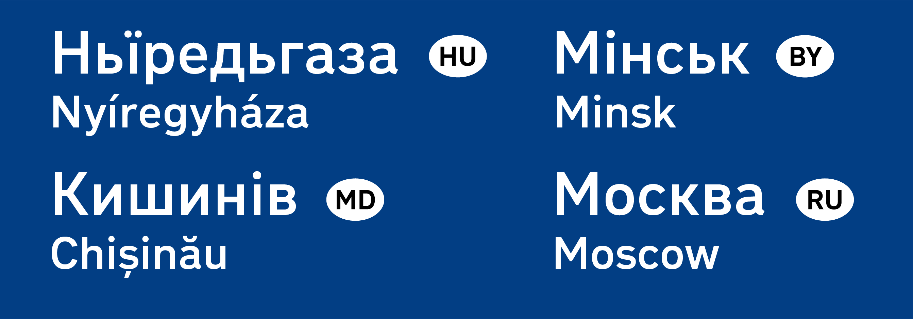

Ілюстрація 4.8 — Приклади написання закордонних назв мовами оригіналу

## 4.5 Розміри текстів

4.5.1 Оскільки всі написи набрані переважно рядковими літерами, то розміри текстів розраховуються для висоти рядкової літери xh. Розмір рядкової літери:

* українських написів — 4x;
* транслітерації/перекладу — 3x (75% від українських написів).

4.5.2 Розмір великої літери — 1,4 * xh (висоти рядкової).

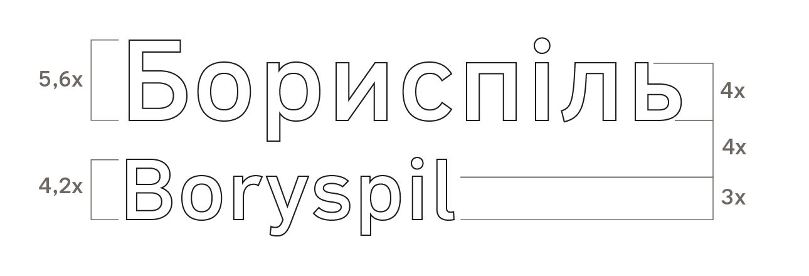

Ілюстрація 4.9 — Розмір літер

4.5.3 Трекінг (відстань між літерами) в усіх написах — 25%.

4.5.4 Довгі назви переносяться на кілька рядків (ілюстрація 4.9). Відстань між лініями тексту — розмір малої літери (для українських написів 4х, для англійських — 3х).

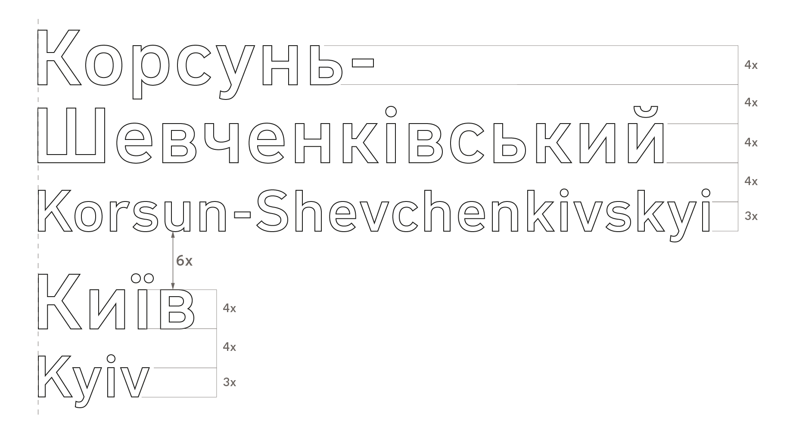

Ілюстрація 4.10 — Напис у кілька рядків

4.5.5 Між блоками населених пунктів відстань 6x (ілюстрації 4.11 та 4.12).

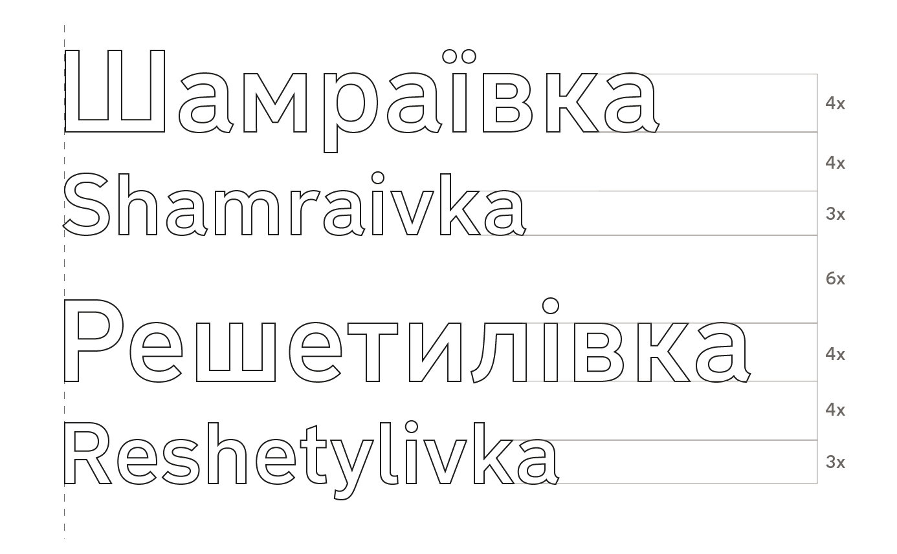

Ілюстрація 4.11 — Розташування і відступи двох назв 4x

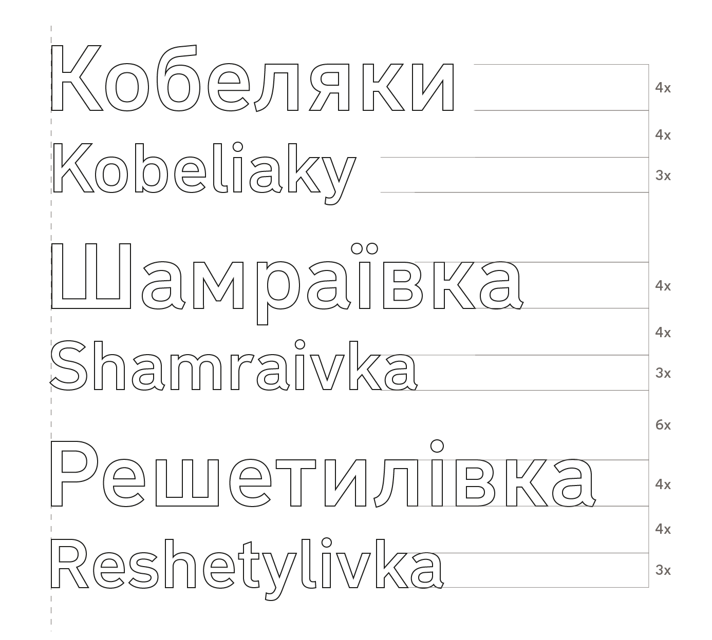

Ілюстрація 4.12 — Розташування і відступи трьох назв

## 4.6 Кольори

4.6.1 В основі всіх дорожніх знаків застосовують вісім кольорів: Білий, Чорний, Синій, Зелений, Коричневий, Жовтий, Червоний, Помаранчевий.

Ілюстрація 4.13 — Кольори

4.6.2 Використання на знаках для:

* міських доріг та вулиць — біле тло, чорний текст;
* інших доріг загального користування — синє тло, білий текст;
* доріг загального користування категорії 1а (автомагістралі) — зелене тло, білий текст;
* туристичних об‘єктів — коричневе тло, білий текст;
* тимчасових інформаційних повідомлень, для ремонту — жовте тло, чорний текст;
* особливо важливих повідомлень — червоне тло, білий текст.

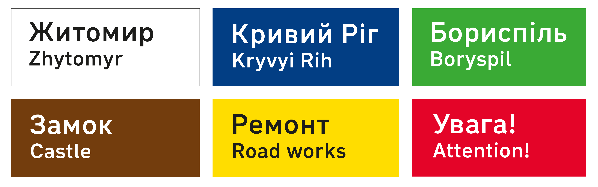

Ілюстрація 4.14 — Кольори тексту і тла

## 4.7 Облямівка

4.7.1 Можливі два види облямівки:

* Біла для знаків з темним тлом (синіх, зелених, червоних, коричневих);
* Додаткова чорна з відступом від краю для знаків зі світлим тлом (білих та жовтих).

Ілюстрація 4.15 — Кольори облямівки знаків

## 4.8 Радіус заокруглення кутів знака

4.8.1 Для знаків з темним тлом:

* Радус заокруглення: зовнішній — R = 1,5x, внутрішній (до облямівки) — R = 1x.
* Товщина — 0,5x.

4.8.2 Для знаків зі світлим тлом:

* Радус заокруглення: зовнішній — R = 1,5x, внутрішній — R = 1x.
* Товщина чорної лінії — 0,5x, відстань від лінії до облямівки — 0,375х.

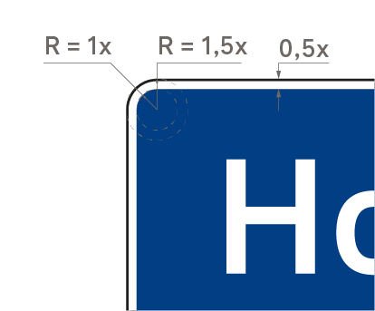

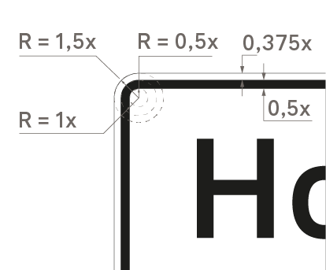

Ілюстрація 4.16 — Радіус заокруглення кутів та розміри облямівки на знаках з темним та світлим тлом

## 4.9 Відстані

4.9.1 Відстані до об’єктів (кілометри) округлюються до:

* значень кратних 1 км, за відстані понад 1 км;
* значень кратних 0,1 км, за відстані менші 1 км. 

4.9.2 Кілометри розміщуються на рівні українського напису, утворивши лінію читання, на відстані не менше ніж 8х. Розмір номеру відстані такий самий, як для українських написів.

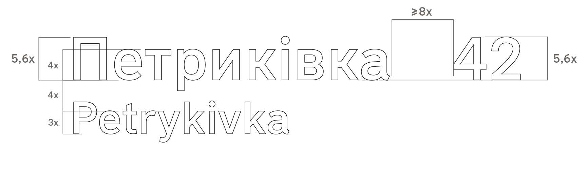

Ілюстрація 4.17 — Розміри та розташування кілометрів

4.9.3 Кілометри для кількох дестинацій вирівнюються за правою стороною (ілюстрація 4.18).

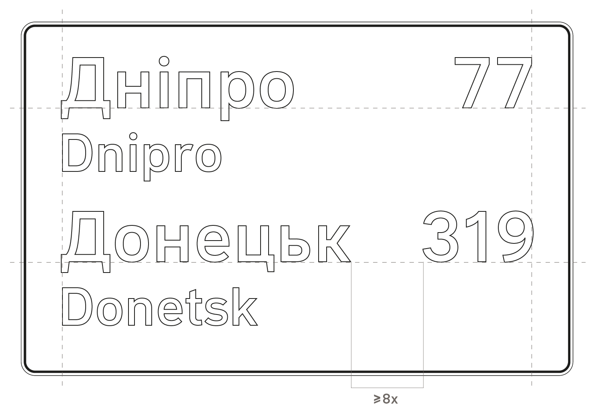

Ілюстрація 4.18 — Вирівнювання кілометрів

## 4.10 Стрілки

4.10.1 Можливі напрямки на вказівниках: ліворуч, прямо і ліворуч, прямо, прямо і праворуч, праворуч. Стрілки вниз не використовуються, адже позначають напрямки «прямо».

Ілюстрація 4.19 — Можливі напрямки

4.10.2 Стрілка складається з _шеврону_ з кутом 90º та_ ніжки_, що в 2 рази довша за _шеврон_ (ілюстрація 4.20).

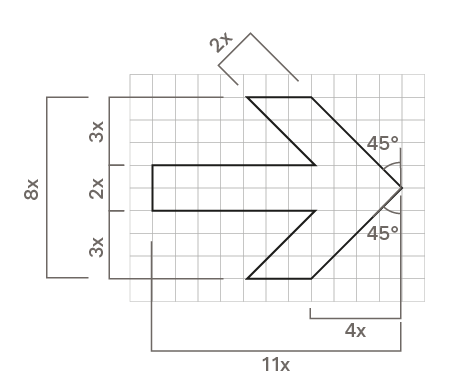

Ілюстрація 4.20 — Будова стрілки

4.10.3 Розворот позначається оберненою стрілкою (ілюстрація 4.21).

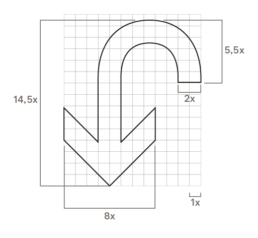

Ілюстрація 4.21 — Будова стрілки розвороту

## 4.11 Номери доріг

4.11.1 Написання номерів для доріг  **Е**,  **М**, **Н** та **Р** через пробіл без дефісів, для доріг **Т** через пробіл два набори по дві цифри розділені коротким тире (ілюстрація 4.22).Номери для доріг О та С не вказуються, оскільки вони занадто складні та довгі.

4.11.2 Кольори, які відповідають кожному типу дороги:
* Е 40 Європейський маршрут — зелений;
* М 03 Міжнародна дорога — червоний;
* Н 01 Національна — червоний;
* Р 16 Регіональна — синій;
* Т 14–02 Територіальна — синій.

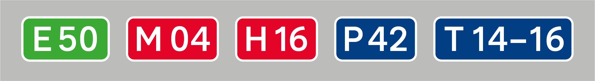

Ілюстрація 4.22 — Вигляд номерів доріг

4.11.3 Навколо кольорового тла номерів присутня рамка білого кольору (розміри на ілюстраціях 4.23 та 4.24).

4.11.4 Існують два розміри номерів: 
* великий, висотою 9х, розміщується зверху на знаках підтвердження та вказівниках;
* малий, висотою 7х, розміщується біля назви населеного пункту.

Номери можуть комбінуватись, якщо ділянкою проходять кілька маршрутів, наприклад, коли дорога  **М** є частиною європейських маршрутів  **Е**. Між номерами відстань: для великих номерів — 3х, для малих номерів — 2х.

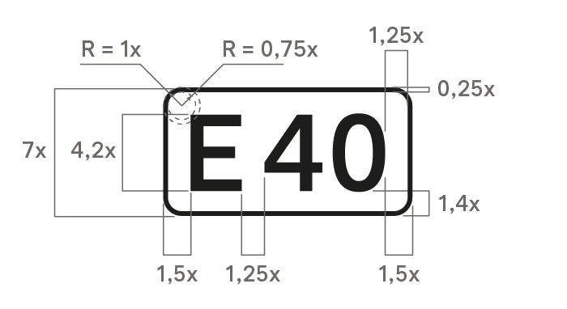
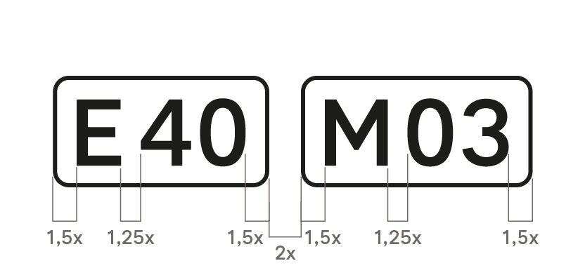

Ілюстрація 4.23 — Будова малого номеру і відстань між номерами

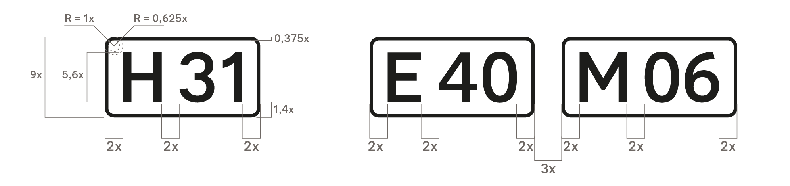

Ілюстрація 4.24 — Будова великого номеру і відстань між номерами

4.11.5 Розміщення номеру

Для одного населеного пункту номер розміщується:

* над назвою, якщо населений пункт один на всьому знаку; розмір номеру великий 9х (ілюстрація 4.25);
* після назви, якщо до населеного пункту потрібно з’їхати з дороги (ілюстрація 4.26).

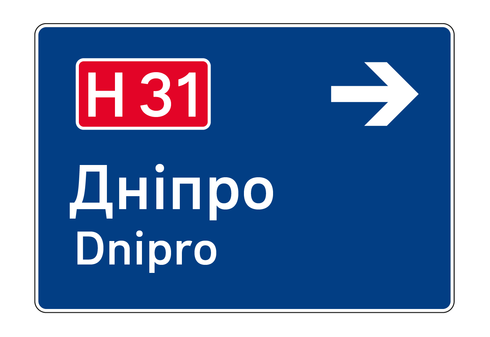
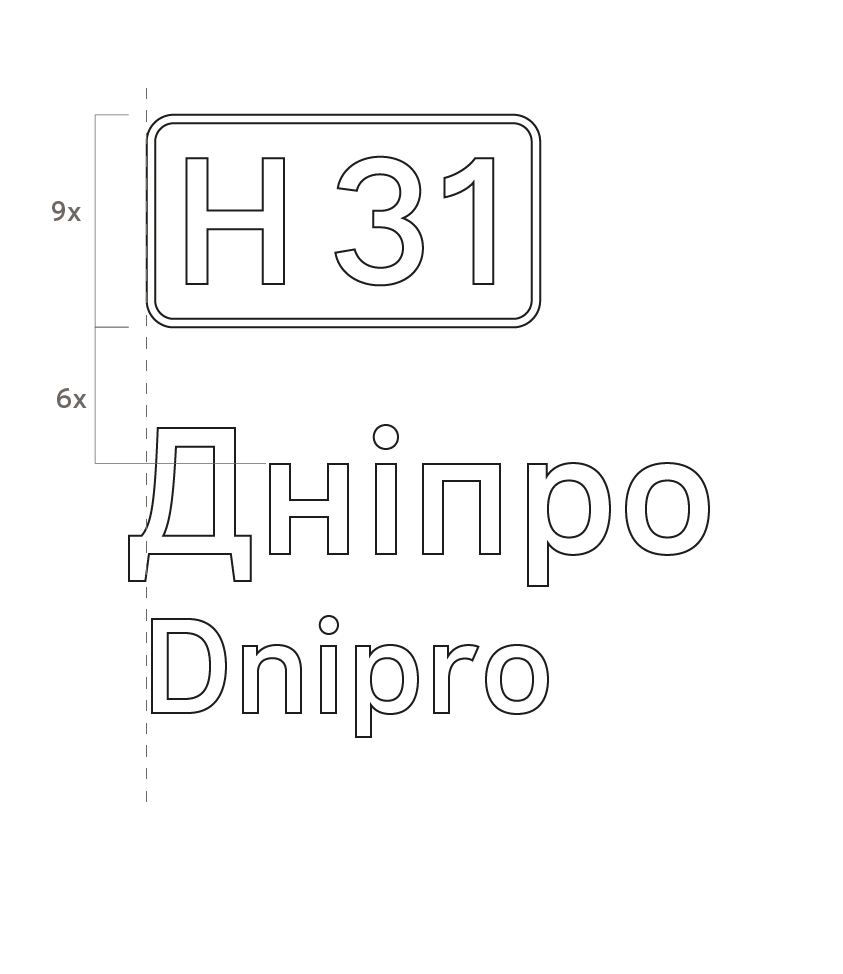

Ілюстрація 4.25 — Великий номер над назвою

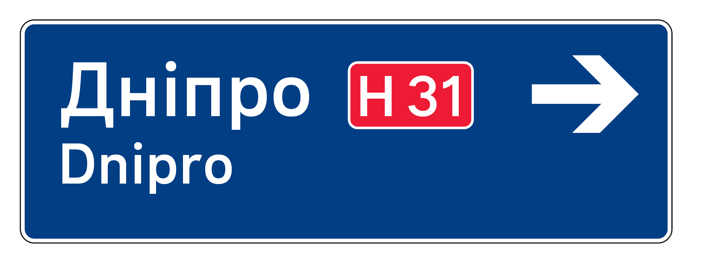
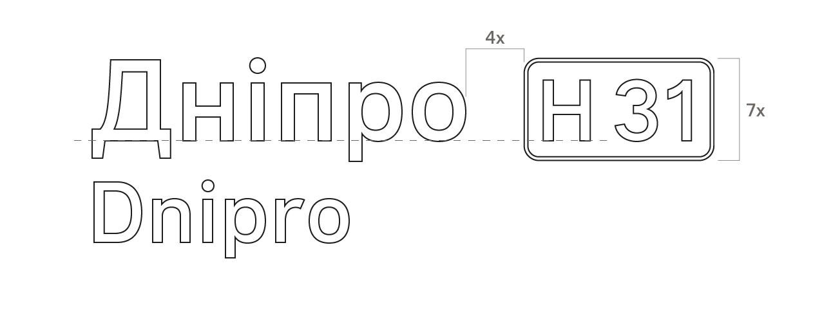

Ілюстрація 4.26 — Малий номер після назви

Для кількох населених пунктів:

*   якщо вони на одному маршруті — ставимо спільний номер, винесений вгору, над усіма назвами; розмір номеру великий 9х (ілюстрація 4.27);
*   якщо вони на різних маршрутах — номер ліворуч або праворуч від назви.

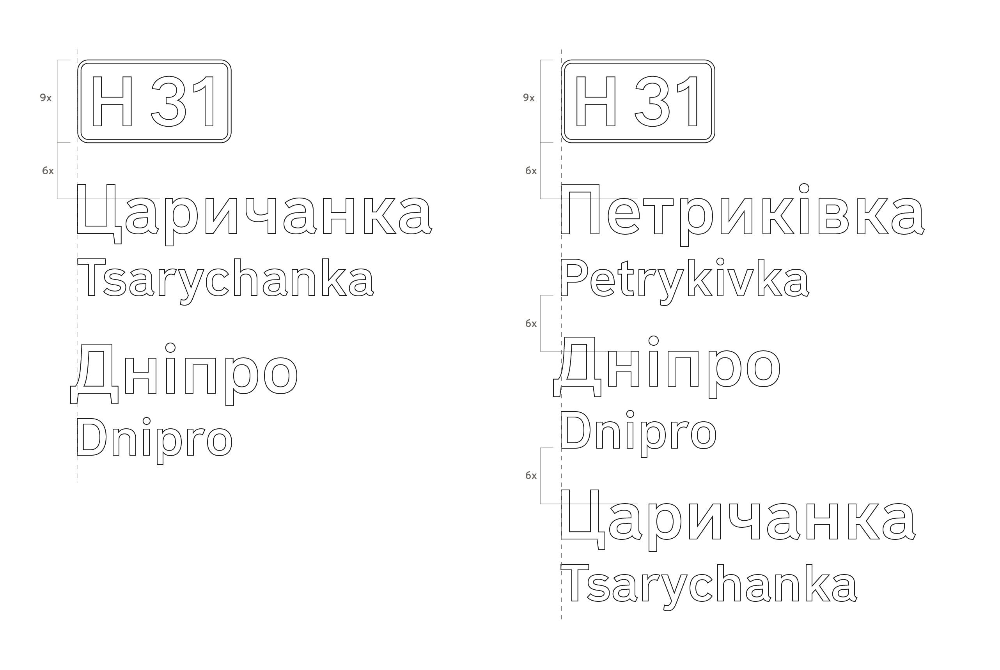

Ілюстрація 4.27 — Великий розмір над всіма назвами

## 4.12 Піктограми

4.12.1 Для позначення окремих об’єктів інфраструктури використовуються піктограми:

*   Аеропорт (літак)
*   Автовокзал (автобус)
*   Залізничний вокзал (потяг)
*   Центр
*   Піктограми з інших дорожніх знаків.

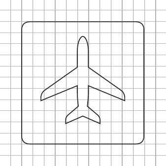

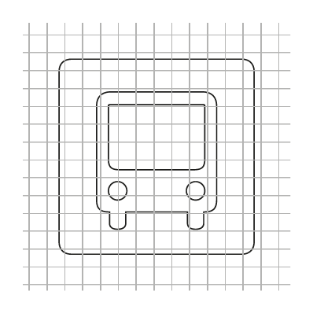

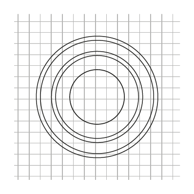

Ілюстрація 4.28 — Піктограми аеропорту, автовокзалу, залізничного вокзалу та центру

4.12.2 Піктограма висотою 11x розташовується ліворуч від написів на відстані 4х від тексту (ілюстрація 4.29). На темному тлі додається біла облямівка — квадрат зі стороною 11х (ілюстрація 4.30).

 та з облямівкою для знаків із темним тлом (знизу)")

Ілюстрація 4.29 — Розмір та розташування піктограми без облямівки для знаків зі світлом тлом (зверху) та з облямівкою для знаків із темним тлом (знизу)

")

Ілюстрація 4.30 — Піктограма з облямівкою (для знаків з темним тлом)

4.12.3 Піктограми, які нагадують стрілки і можуть бути з ними сплутані (наприклад, позначка аеропорту), потрібно обертати разом зі стрілкою. При використанні стрілки для розвороту символ літака має бути спрямований ліворуч і не повинен спрямовуватись вниз (ілюстрації 4.31 та 4.32).

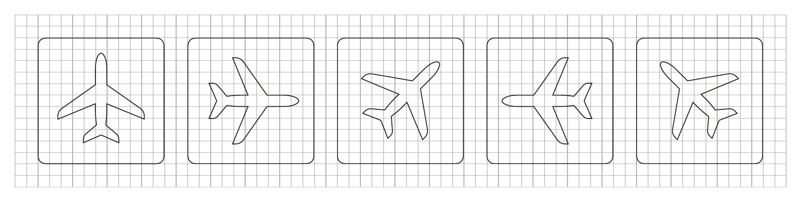

Ілюстрація 4.31 — Варіанти орієнтації піктограми аеропорту

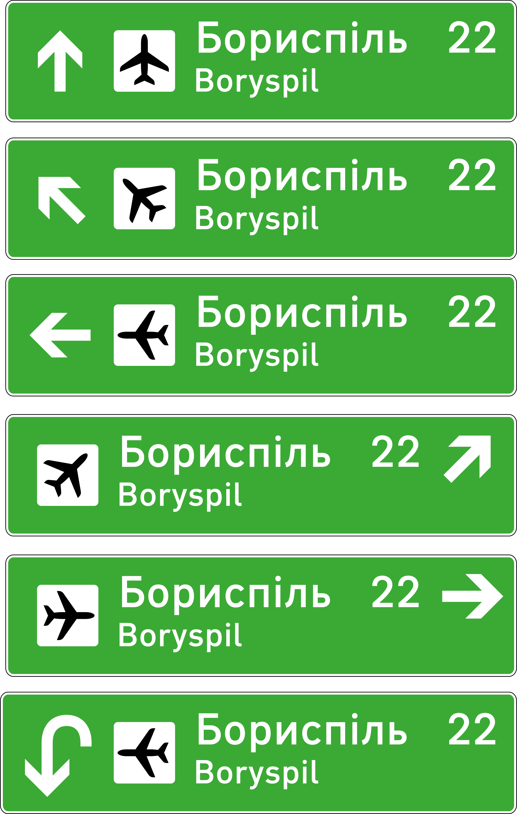

Ілюстрація 4.32 — Приклади знаків напрямку до аеропорту

## 4.13 Райони та центр

4.13.1 Коли можливі кілька різних в‘їздів у населений пункт, варто вказувати додатковий орієнтир: в яку частину населеного пункту веде дорога.

* Вказується назва району населеного пункту, якщо в місті є визначені назви районів, наприклад, Оболонь;
* Якщо таких районів немає, то варто використовувати географічне розташування (сторони світу) — схід, захід, північ, південь;
* Окремо варто позначати напрямок до центру населеного пункту, додаючи піктограму центру.

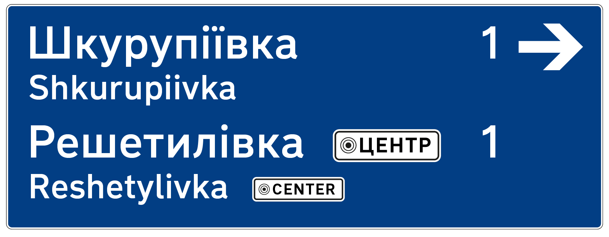

Ілюстрація 4.33 — Вигляд знака з позначкою району

4.13.2 Район розташовується на білому тлі з чорною облямівкою. Текст набирається всіма заголовними літерами (ілюстрація 4.34).

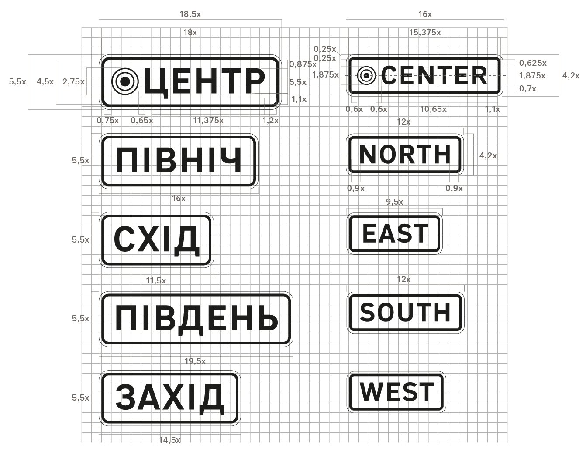

Ілюстрація 4.34 — Будова позначок районів

4.13.3 Українська назва та трансліт або англійський переклад для географічного розташування (частин світу) вказуються окремо. Українська позначка розташовується після назви на відстані 4х, трансліт/англійська — на відстані 3х.

Ілюстрація 4.35 — Розташування позначок районів

## 4.14 Будова символу перетину доріг

4.14.1 Якщо дестинація розташована в місці перетину з дорогою міжнародного значення М, то до назви додається позначка перетину з іншою дорогою — піктограма білого кольору у вигляді перетину двох доріг. Біля піктограми додають номери дороги, перетин з якою попереду.

4.14.2 Блок перетину розташовується під блоком назви населеного пункту на відстані 6x (ілюстрації 4.36 та 4.37).

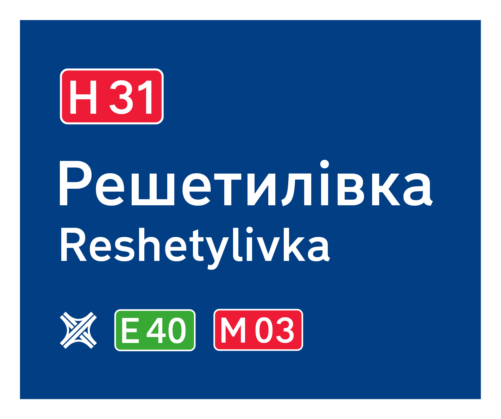

Ілюстрація 4.36 — Вигляд символу перетину з дорогою E 40 M 03

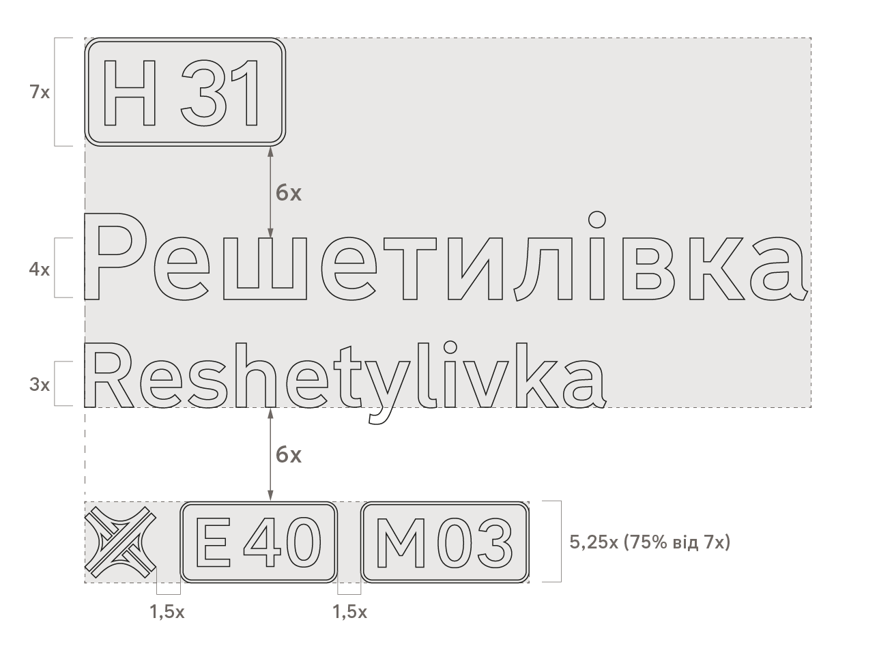

Ілюстрація 4.37 — Розташування блоку перетину доріг
>

4.14.3 Будова символу перетину:

 та збільшений розмір (праворуч)")

Ілюстрація 4.38 — Реальний розмір (ліворуч) та збільшений розмір (праворуч)

## 4.15 Коди країн

4.15.1 Біля прикордонних та закордонних населених пунктів вказуються коди країн:

*   для українського прикордонного населеного пункту вказуються два коди — код України UA та код країни, на кордоні з якою розташовано КПП (Чоп UA HU);
*   якщо на знаку вказується закордонний населений пункт, то біля нього вказується лише один код країни, в якому це місто розташовано (Warszawa PL).

4.15.2 Номер країни зображується у формі еліпсу, розмірами 7,5x довжина та 5,5x висота. Висота літер — 2,5х, текст вирівнюється відносно центру еліпса. Відстань між кодами — 1,5х.

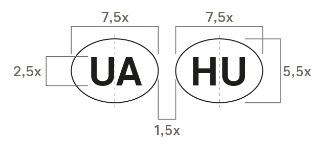

Ілюстрація 4.39 — Будова кодів країн

4.15.3 Літери кодів чорні, тло коду — біле. На кольорових знаках код без зайвих рамок, на білому тлі додається чорна рамка розміром 0,25х.

Ілюстрація 4.40 — Кольори кодів країн

4.15.4 Код розташовується після української назви населеного пункту на відстані 4x.

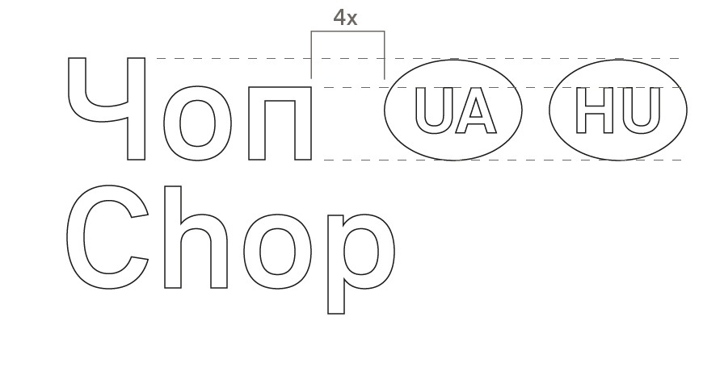

Ілюстрація 4.41 — Розташування кодів після назви

4.15.5 Якщо населений пункт межує з кількома країнами (є КПП у кожну з країн), то додаються коди кожної країни.
