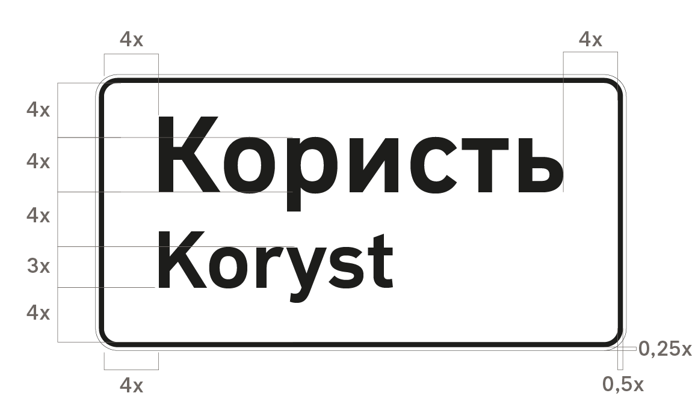
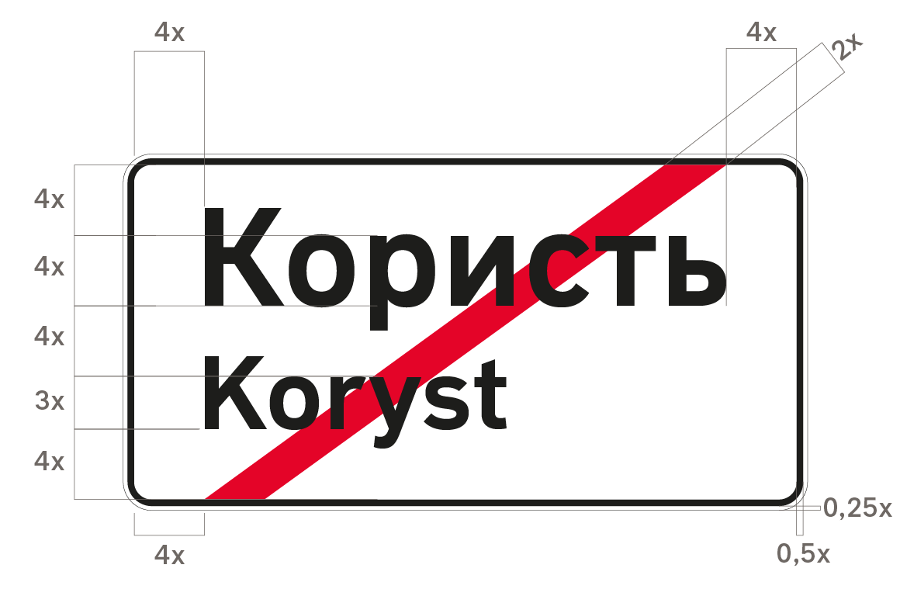

# 5. Компонування знаків 

## 5.1 Напрямок руху (знак 5.52)

5.1.1 Один  напрямок. Стрілка розташовується на рівні першого рядка та утворює лінію читання. Відстань до стрілки: 4x для стрілок ліворуч від написів та 6x для стрілок праворуч. Відстань від облямівки до будь-яких елементів знаку — 4х від правого та лівого країв, 5х —від верхнього та нижнього країв, а до оголівка стрілки — 3x. (ілюстрація 5.1).

На знаках з кількома населеними пунктами зображується одна стрілка та розташовується на рівні першої назви (ілюстрації 5.2 та 5.3).

Ілюстрація 5.1 — Будова знаків напрямку з одним напрямком

Ілюстрація 5.2 — Будова знаків напрямку з двома населеними пунктами в одному напрямку

Ілюстрація 5.3 — Будова знаків напрямку з трьома населеними пунктами в одному напрямку

5.1.2 Кілька напрямків. Якщо на знаку присутні кілька напрямків, то кожен напрямок від інших відділяється білою лінією (ілюстрація 5.4). Товщина лінії-розділювача — 0,5х. Від написів до лінії відстань 5х, від верхнього та нижнього краю знака 5х. Написи вирівнюються один з одним за лівим краєм. Стрілки ↑, ↖ та ← розташовані ліворуч від написів, стрілки ↗ та → — праворуч.

Порядок розташування напрямків на знаку (зверху вниз):

*   ↑ вперед
*   ↖ вперед і ліворуч
*   ← ліворуч
*   ↗ вперед і праворуч
*   → праворуч

Ілюстрація 5.4 — Приклад знаків з кількома напрямками

Ілюстрація 5.5 — Варіанти будови знака з двома різними напрямками

Ілюстрація 5.6 — Будова знака з трьома різними напрямками

5.1.3 На знаки напрямків також діє правило «не більше, ніж три назви на знаку» Якщо назв більше ніж три, то варто розділяти їх на кілька знаків, згрупувавши на кожному зі знаків напрямки в один бік (ілюстрація 5.7).

Ілюстрація 5.7 — На окремі знаки винесено поворот праворуч, рух прямо та міські об'єкти

5.1.4 З’їзд з дороги. Для з’їзду використовується знак зі зрізаним краєм, який своєю формою підсилює сприйняття напрямку в бік з основної дороги. Зазвичай такий знак використовується на з’їздах з багаторівневих розв’язок разом з напрямками прямо (ілюстрація 5.8).

Ілюстрація 5.8 — Знак з’їзду (праворуч) поруч зі знаками руху прямо

Ілюстрація 5.9 — Будова знака з’їзду з дороги

5.1.5 Комбінування напрямків різних типів. Міську навігацію (на білому тлі) та заміську (на синьому тлі) треба розділяти на різні фізичні носії для розділення контексту (ілюстрація 5.10). Утім, загальна кількість напрямків на обох знаках не має перевищувати три.

Також краще робити знаки однакової довжини, щоб їх комбінація виглядала більш естетичною.

Ілюстрація 5.10 — Комбінування різних знаків на одній опорі

5.1.6 Принципи вибору дестинацій.

Напрямки можна розділити на три типи: вперед, з’їзд з дороги наліво чи направо, розворот. На знаку вказують не більше трьох дестинацій в сумі, незалежно від того, скільки знак відображає напрямків.

В одному напрямку вказують:

1. Найближчий населений пункт. Для розвороту до уваги беруть також населені пункти, що лежать поза поточною дорогою.
2. Населений пункт із найвищим статусом між найближчим та кінцевим.
3. Кінцевий населений пункт.

Ілюстрація 5.11 — 

--- Приклади: мапи, де відмічене місце з’їзду і підсвічено населені пункти з поясненнями, а також показано знак з населеними пунктами ---

Якщо у відповідному напрямку більше 3-х населених пунктів, то розглядають лише ті, в яких проживає понад 100 людей.

Якщо на маршруті є кілька населених пунктів однакового статусу, вказують найближчий з них.

Якщо є можливість вказати лише два населених пункти, вказують:

1. Населений пункт із найвищим статусом, окрім кінцевого.
2. Кінцевий населений пункт.

Якщо поняття кінцевого населеного пункту неможливо використати для певного напрямку, вказують найвіддаленіший від дороги населений пункт. Наприклад, якщо дорога, яка відгалужується, відходить від поточної дороги, робить гак і повертається до поточної дороги.

Ілюстрація 5.12 — На дорозі М 06 після Корцю розташовано чотири невеликих населені пункти і ще два великі — Луцьк та Тернопіль — у тому ж напрямку, але зі з’їздом на інші дороги. Потрібно два знаки: на першому — найближчі населені пункти (Гоща та Рівне), на другому — більш віддалені (Львів та Чоп).

## 5.2 Напрямок руху з відстанню (знаки 5.53 і 5.54)

5.2.1 На з’їздах з доріг може встановлюватись знак напрямку руху із вказанням відстані до населених пунктів. Для відстаней діє таке ж правило, як для знаків підтвердження — число розташовується праворуч від напису на рівні українського тексту, на відстані не менше ніж 8x від самого тексту. Стрілка розташовується за числом на відстані 4х.

Ілюстрація 5.13 — Приклади знаків напрямків руху з відстанями

Ілюстрація 5.14 — Будова знаків напрямків руху з відстанями

## 5.3 Напрямок до визначних місць (знак 5.53)

5.3.1 Визначними місцями ми вважаємо об’єкти, що можуть становити значний інтерес для туристів, об’єкти транспортної, спортивної та туристичної інфраструктури, об’єкти культурної спадщини. Оскільки чіткі критерії об’єктів, які варто відображати на знаках маршрутного орієнтування, визначити неможливо, рішення ухвалюють окремо в кожному випадку. Найефективнішим є обговорення об’єктів із представниками місцевої громади та за участі замовника проєкту. Принципи дизайну такі ж, як у знаків напрямків до населеного пункту. 

Ілюстрація 5.15 — Напрямок до визначного місця, без додаткових піктограм

## 5.4 Напрямок до вулиць та до центру населеного пункту (знак 5.53)

5.4.1 У населених пунктах на знаках вказують назви вулиць, які примикають до дороги і доступні водієві для з’їзду. У населених пунктах зі щільною мережею вулиць ознакування кожної вулиці може призвести до значного захаращення дороги знаками. Щоб запобігти цьому, в таких ситуаціях ознаковують лише значущі вулиці: магістральні, з великою кількістю визначних об’єктів, історичні тощо.

##### 

Ілюстрація 5.16 — Кілька об’єктів з напрямком

5.4.2 Якщо є кілька різних напрямків, вони відділяються чорною лінією завтовшки 0,5x.

5.4.3 Напрямок до центру населеного пункту. Якщо поняття центру релевантне для населеного пункту, повз або крізь який пролягає дорога, на знаку вказують напрям до центру. Відповідний знак встановлюють перед з’їздами, що виводять у центр оптимальним маршрутом.

Ілюстрація 5.17 — Напрям до центру

## 5.5 Схема (знак 5.51)

5.5.1 Схема — це схематичне відображення конфігурації перетину доріг у вигляді тих маневрів, які має виконати водій.

Ілюстрація 5.18 — Приклади схем

5.5.2 На схемі відображають не більше семи дестинацій і зазвичай не більше двох для кожного з напрямів. Населені пункти для кожного напрямку обирають за наступним правилом:

1. населений пункт із найвищим статусом далі цією дорогою, окрім кінцевого чи найвіддаленішого;
2. кінцевий (найвіддаленіший).

Якщо напрямків більше 3-х, для деяких з них доводиться вказувати лише один населений пункт (починаючи з найменш пріоритетних напрямків), тоді вказують населений пункт із найвищим статусом або найближчий з тих, що мають найвищі статуси.

У окремих випадках для напрямку вказують три дестинації (ілюстрація 5.19). Наприклад, якщо знак направляє до перетину значних автомобільних доріг і попереду залишився лише один населений пункт, у відповідному напрямку можна вказати:

1. кінцевий населений пункт поточної дороги, в якому розташовано перетин з іншою дорогою;
2. кінцевий населений пункт дороги, що перетинає поточну дорогу;
3. інший кінцевий населений пункт дороги, що перетинає поточну дорогу.

Ілюстрація 5.19 — Попереду три дестинації: Решетилівка, Київ та Полтава

5.5.3 Принципи будови схем: схема має дати водієві уяву про маневри на вузлі (ментальну карту) і має відображати лише можливі напрямки руху (ілюстрація 5.20). 

Ілюстрація 5.20 — Вгорі — будова розв’язки, знизу — схема руху на розв’язці (рух знизу вгору)

5.5.4 Варто спрощувати сприйняття маневру та не робити зайвої деталізації.

Ілюстрація 5.21  — Реальний маневр роз’їзду та спрощений маневр на схемі

5.5.5 Підписи різних напрямків потрібно розносити так, щоб унеможливити помилки водія під час зчитування знака, особливо на високій швидкості. Наприклад, при повороті текст одних напрямків може бути близько до тексту іншого знаку (ілюстрація 5.22). Щоб уникнути такого потрібно явно розносити текст різних напрямків (ілюстрація 5.23).

Ілюстрація 5.22 — Приклад підписів напрямків, які роблять помилки водія можливими

Ілюстрація 5.23 — Приклад підписів напрямків, які унеможливлюють помилки водія

 

Найкраще розташування текстів на схемах — розміщення безпосередньо в бік напрямку руху на схемі: ліворуч для руху ліворуч, праворуч для руху праворуч, вгору для руху прямо.

Ілюстрація 5.24 — Рознесені напрямки в три різні сторони

5.5.6 Якщо схема має дати уяву про складний маневр, цей маневр потрібно показати крупно. 

Ілюстрація 5.24 — Маневр крупно

5.5.7 Для спрощення орієнтування на схемі можна виділити пріоритетний головний напрямок руху за допомогою більшої товщини лінії. Наприклад, на Н31 прямо йде велика магістраль, а від неї відокремлюються з’їзди та віднесені повороти ліворуч. У таких випадках напрям прямо можна виділити більшою товщиною.

При цьому виділення не має протирічити пріоритетам руху на перехресті.

Ілюстрація 5.25 — Виділення головної дороги більшою товщиною лінії

5.5.8 Симетрія. Для кращої естетики, розв’язки, наприклад, з трьома напрямками, рекомендовано робити симетричними або близькими до рівносторонніх фігур.

Ілюстрація 5.26 — Розв’язка близька формою до ромбу

5.5.9 Лінії та стрілки. На схемах лінії можуть бути двох розмірів товщиною: 2x та 3x (для пріоритетного напрямку).

Ілюстрація 5.27 — Розміри великої та малої стрілки

5.5.10 Текст розміщується біля стрілок на відстанях 5x для великої стрілки та 4x для малої стрілки. Для напрямків праворуч і ліворуч текст потрібно розміщувати в напрямку руху (навпроти стрілки), верхній край стрілки вирівнюється по краю великої літери (ілюстрація 5.28).

При розташуванні написів ліворуч від стрілки відстань вимірюються до границі блоку тексту.

Ілюстрація 5.28 — Відстань розміщення тексту з кожного боку стрілки

Написи у напрямку прямо можуть розташовуватись, як зверху, так і поруч зі стрілкою (ілюстрація 5.29), якщо це не погіршує зчутвання та помилкове сприйняття написів різних напрямків (п. 5.5.5).

Ілюстрація 5.29 — Розташування тексту напрямку прямо (над стрілкою та поруч зі стрілкою)

5.5.11 Якщо існує перетин доріг на різних рівнях, є шляхопровід або міст, на схемі додається позначка цього перетину (ілюстрація 5.30).

Розмір елементу перетину однаковий, незалежно від товщини лінії та пріоритету (ілюстрація 5.31).

Ілюстрація 5.30 — Приклад розв'язки «конюшина» з використанням перетину

Ілюстрація 5.31 — Будова перетину

5.5.12 Якщо шляхопровід важливий для розуміння дорожньої ситуації, його позначають незалежно від наявності дороги на самому шляхопроводі (ілюстрація 5.32).

Ілюстрація 5.32 — Приклад 

5.5.13 Комбінування кольорів тла. У випадках, коли на схемі зазначають дестинації, розташовані на різних категоріях доріг, окремі населені пункти зазначають на кольоровому тлі.

Колір тла залежить від розташування дестинації:

*   біле тло, якщо об’єкт розташовується в межах населеного пункту;
*   синє тло, якщо об’єкт за містом;
*   зелене тло, якщо об'єкт за містом і шлях до нього пролягає автомагістраллю.

Відстані від країв кольорового тла — 4х (ілюстрація 5.53).

Ілюстрація 5.33 — Комбінування кольорів тла

5.5.14 У випадках, коли передбачено обмеження чи особливості руху на окремих ділянках дороги, дорожні знаки можна розміщувати на лініях напрямків. Розмір знака має бути не більше 9х по довшій стороні, а відступи від знака до інших елементів — 4х з кожного боку.

Ілюстрація 5.34 — Схема розташована в межах населеного пункту, на якій у напрямку прямо заборонено пересування вантажівок

5.5.15 Відстань від облямівки до елементів знаку — 6х. Вона більша ніж на знаках напрямків, оскільки схеми мають велику площу і для кращої читабельності написів, потрібна більша відстань від країв.

Відстань між блоками різних напрямків має бути більше ніж 8x (більше ніж між елементами всередині блоку). Для кращої естетитки відстані потрібно робити кратними 4x.

Ілюстрація 5.36 — 

5.5.16 Рекомендовано елементи схем (повороти, перетини, згини та інші маневри) робити загальними розмірами кратними 4x, а відстань від основної лінії не меншою ніж 8x (приклади будови деяких маневрів на малюнках 5.35–5.38). 

 

Ілюстрація 5.35 — Поворот праворуч та розворот

Ілюстрація 5.36 — З’їзд та розгалуження дороги з проїздом під шляхопроводом

Ілюстрація 5.37 — Повороти ліворуч та праворуч на «конюшині»

Ілюстрація 5.38 — Розворот та віднесений поворот ліворуч

5.3.17 Якщо знак розташовано від маневру далі ніж 500 метрів, на знаку вказується відстань до маневру (метраж). Відстань вказується в метрах.

Ілюстрація 5.39 — Схема з вказаною відстанню до маневру

Розмір позначки метражу тексту такий самий, як у транслітерованого тексту — рядкова літера 3х.

Метраж розташовується знизу знака, на відстані 6х від краю, праворуч або ліворуч від лінії дороги на відстані 4х, та не ближче ніж 8х від найближчого напису чи елементу (ілюстрація 5.40).

Ілюстрація 5.40  — Розташування на знаку позначки відстані відносно країв, ліній і написів

## 5.6 Підтвердження руху (5.59)

5.6.1 Цей знак підтверджує рух водія в правильному напрямку та складається з таких елементів:

*   великий номер дороги, якою прямують, або кілька номерів, якщо знак розташовано на ділянці, якою проходить кілька доріг;
*   наступний по дорозі населений пункт;
*   термінальний населений пункт (кінцевий на цій дорозі);
*   додається лінія-розділювач, а номер дороги ставиться після назви, якщо в тому ж напрямку є важливий населений пункт, але щоб дістатись до нього, потрібно з’їхати на іншу дорогу.

Ілюстрація 5.41 — Приклад знаку підтвердження. На знаку: дорога, якою прямуємо — Н31; наступний населений пункт по дорозі — Петриківка; термінальний населений пункт (кінцевий на цій дорозі) — Дніпро; Донецьк в тому ж напрямку, але потрібно буде з’їхати на М04

Ілюстрація 5.42 — Будова знака підтвердження

Ілюстрація 5.43 — Розміщення кількох номерів вгорі знака, відступи праворуч і ліворуч однакові

5.6.2 Принципи вибору дестинацій. На одному знаку вказують не більше трьох дестинацій і відстані до них. На дорогах типу Т і Р, відповідно до цих правил, встановлюють по одному такому знаку. На дорогах з індексом Н і М — по два.

5.6.3 Два знаки підтвердження на дорогах Н і М встановлюють за необхідності, якщо дестинацій, відповідних правилам, попереду більше ніж три (ілюстрація 9.3.1).

    _Перший знак_

    1.1. Найближчий населений пункт попереду.

    1.2. Найближчий значущий населений пункт попереду, що лежить після 1.1.

    1.3. Найближчий з’їзд до значущого населеного пункту.

    _Другий знак_

    2.1. Населений пункт із найвищим статусом на цій дорозі, що лежить між 1.2 та кінцевим.

    2.2. Кінцевий населений пункт.

    2.3. З’їзд (після 1.3) до населеного пункту найвищого статусу з тих, що лежать на дорогах, які примикають до поточної.

Ілюстрація 5.44 — Два знаки підтвердження

5.6.4 Один знак підтвердження.

1. Найближчий населений пункт попереду на цій дорозі.
2. Найближчий значущий населений пункт попереду або найближчий з’їзд до значущого населеного пункту (залежно від того, що ближче для водія).
3. Кінцевий населений пункт цієї дороги.

##### 

Ілюстрація 5.45 — Один знак підтвердження

Населений пункт розташовується на цій дорозі, якщо дорога проходить через сам населений пункт або на відстані меншій ніж 500 м від межі населеного пункту, і з дороги є з’їзд до нього.

Якщо до найближчого населеного пункту менше ніж 1 км, на знаку вказують наступний.

Якщо після з’їзду водій може дістатися до декількох значущих населених пунктів одним маршрутом, вказується найближчий населений пункт із тих, що мають найвищий статус із доступних.

Іноді кінцевий населений пункт, що фігурує в назві дороги, не збігається з реальним кінцевим населеним пунктом (фактичним кінцем дороги). У такому випадку в пункті 3 використовують назву того населеного пункту, який зазначено в назві дороги. І вже після цього населеного пункту — реальний кінцевий населений пункт. Так, скажімо, на дорозі Т14–02 (Пісочна — Східниця) в напрямку на Східницю до самої Східниці в п.3 зазначається Східниця, і вже після Східниці зазначається Явора, де фактично закінчується дорога.

Якщо ми вказуємо населений пункт, доступний через з’їзд на іншу дорогу, його відображають на 3-й позиції (див. Зовнішній вигляд).

5.6.5 Значущі населені пункти

Значущими населеними пунктами приймаються значущими обласні центри, міжнародні автомобільні пункти пропуску через державний кордон, морські та авіаційні порти міжнародного значення, населені пункти з найважливішими об’єктами національної культурної спадщини, курорти, великі промислові і культурні центри.

На дорогах з індексом Р приймаються значущими населеними пунктами також районні центри і населені пункти обласного значення, але вони не враховуються для зазначення з’їздів з дороги.

На дорогах з індексом Т значущим є будь-який адміністративний центр, але для з’їздів з дороги розглядають лише центри районів і вищі за статусом населені пункти.

## 5.7 Початок та кінець населеного пункту

5.7.1 На знаках 5.45 та 5.46 використовується біле тло та чорний текст (ілюстрація 5.46). Розмір рядкової літери українського тексту — 4х, вирівнювання за лівим краєм, розмір трансліту — 3х. Зверху, знизу та з боків — 4х. Вздовж краю знака іде чорна облямівка завтовшки 0,5х, а після неї — біла завтовшки 0,25х.

5.7.2 На знаках 5.47 та 5.48 використовується синє тло та білий текст (ілюстрація 5.47). Розмір рядкової літери українського тексту — 4х, вирівнювання за лівим краєм, розмір трансліту — 3х. 

5.7.3 На знаках 5.46 та 5.48 (кінець населеного пункту) додається лінія червоного кольору завширшки 2х, яка розташовується за текстом. Лінія починається та закінчується на відстані 4х від країв знака.

Ілюстрація 5.46 — Будова знаків 5.45 та 5.46

Ілюстрація 5.47 — Будова знаків 5.46 та 5.47

5.7.4 Довгі назви для компактності знаку можна розміщувати в кілька рядків. Відстань між рядками: для української мови — 4х, для для трансліту — 3х.

## 5.8 Річки та інші водойми (знак 5.58.2)

5.8.1 Річки, озера та інші водойми позначаються знаком синього кольору з назвою та зображенням хвилі. До назв додаються скорочення типів водойм (річка, озеро тощо; таблиця ). Назва вирівнюється за центром (ілюстрація 5.48).

Ілюстрація 5.48 — Вигляд знака позначення річки

5.8.2 Один сегмент хвилі розмірами 6х × 3х (ілюстрація 5.49), товщина лінії 0,75х. На знаку один за одним розташовується ціла кількість сегментів хвиль на ширину назви. Якщо за шириною назви виходить не ціла кількість хвиль, цю кількість потрібно округлити до цілої в більшу сторону, наприклад, 6,3 округлюється до 7.

Ілюстрація 5.49 — Будова хвилі

5.8.3 Хвилю не можна масштабувати, розтягувати або стискати.

Ілюстрація 5.49 — Заборонена трансформація хвиль

## 5.9 Інформаційні панно та повідомлення

5.9.1 На інформаційних панно повідомлення відображаються двома мовами: українською та англійською, як загальновживаною у світі.

5.9.2 Написи вирівнюються за лівим краєм для кращої зчитуваності.

5.9.3 Колір інформаційних панно може бути трьох видів:

*   біле тло та чорний текст — для звичайних повідомлень про дорожніх рух (наприклад, вузький міст, розворот зустрічного транспорту, тощо);
*   жовте тло та чорний текст — для привернення уваги водія (наприклад, про зону блокпосту) або для повідомлень про ремонт;
*   червоне тло та білий текст — для найважливіших повідомлень (наприклад, про встановлення нових дорожніх знаків).

 

Ілюстрація 5.50 — Приклади інформаційних панно

5.9.4 На інформаційних панно доцільно використання дорожніх знаків та піктограм, якщо ці піктограми чи знаки краще передають повідомлення. Розташування піктограм — за вертикальним центром знаку.

Варто використовувати позначки, що якомога наочніше і зрозуміліше передають ситуацію, навіть якщо “офіційно” такого знаку немає. Наприклад, для привернення уваги до розвороту зустрічного транспорту можна зобразити сам маневр, щоб піктограма передавала повідомлення навіть без тексту (ілюстрація 5.51).

Ілюстрація 5.51 — Знак попередження про розворот зустрічного транспорту

5.9.5 Керуючись принципом мінімальних текстових повідомлень, текст має бути максимально стислим, щоб водій зміг його прочитати на швидкості.

Таблиця 5.1 — Правила написання текстів на інформаційних панно

<table>
  <tr>
   <td>Правило
   </td>
   <td>Приклад, як не треба писати
   </td>
   <td>Приклад, як треба
   </td>
  </tr>
  <tr>
   <td>Не треба писати на знаках слово «Увага!», оскільки знак своїм виглядом привертає увагу. 
   </td>
   <td><em>Увага! Попереду блокпост!</em>
   </td>
   <td><em>Блокпост</em>
   </td>
  </tr>
  <tr>
   <td>Не треба писати «попереду», коли знак просто описує ситуацію попереду, як це міг би описати, наприклад, знак 1.5.1 «Звуження дороги», який теж описує ситуацію попереду.

Виключенням може бути наявний напрям, якщо водієві треба зробити маневр, або наголошення на нестандартній ситуації, як у повідомленні про нові дорожні знаки.

У разі установки знаку заздалегідь, варто вказувати відстань до описаної події чи об’єкта.

Якщо знак описує конкретну ділянку, то треба писати довжину цієї ділянки.
   </td>
   <td><em>Увага! Попереду вузький міст!</em>

<em>Нові дорожні знаки</em>
   </td>
   <td><em>Вузький міст</em>

<em>Вузькі мости (наступні 3 км)</em>

<em>Попереду нові дорожні знаки</em>
   </td>
  </tr>
  <tr>
   <td>Не треба звертатись «Водій» чи «Водії», оскільки всі знаки це повідомлення до водіїв.

Звернення доречне, якщо повідомлення адресоване конкретній групі людей, наприклад, тільки водіям вантажівок.
   </td>
   <td><em>Водій, увімкни фари!</em>
   </td>
   <td><em>Увімкніть фари!</em>
   </td>
  </tr>
  <tr>
   <td>Не треба писати «Ви в’їжджаєте …», оскільки знак і так стосується зони, в яку водій в’їжджає.
   </td>
   <td><em>Ви в’їжджаєте в зону блок-поста</em>
   </td>
   <td><em>Зона блокпоста</em>
   </td>
  </tr>
  <tr>
   <td>Варто скорочувати фрази та використовувати більш стислі відповідники
   </td>
   <td><em>Вогнепальна і холодна зброя, вибухові речовини — не допускаються</em>
   </td>
   <td><em>Зброя та вибухові речовини заборонені</em>
   </td>
  </tr>
  <tr>
   <td>Найкраще стисло описати дію, яку водієві треба зробити, або описати ситуацію
   </td>
   <td><em>Будь ласка, приготуйте ваші документи.</em>
   </td>
   <td><em>Приготуйте документи.</em>
   </td>
  </tr>
  <tr>
   <td>Кілька обмежень варто перелічувати списком, одне речення — один рядок.
   </td>
   <td><em>Знизьте швидкість до 5 км/год.</em>

<em>Будь ласка, приготуйте ваші документи.</em>

<em>Вогнепальна і холодна зброя, вибухові речовини — не допускаються</em>

<em>в зоні відповідальності.</em>
   </td>
   <td><em>Швидкість до 5 км/год.</em>

<em>Приготуйте документи.</em>

<em>Зброя та вибухові речовини заборонені.</em>
   </td>
  </tr>
</table>

Ілюстрація 5.52 — Приклад зміни інформаційний панно: інформація та сама, а подача інша

Текст «Увага» ми замінили на піктограму знаку 1.39, прибрали зайве «Попереду» та додали переклад англійською.

Суцільне полотно тексту, яке вирівнюється по центру і яке важко читати, замінили на короткий заголовок, який передає основне повідомлення про початок зони блокпосту, інший текст скорочений до списку з чітких інструкцій, а піктограмою виділили основне обмеження швидкості до 5 км/год.

Текст вирівняли по лівому краю, додали переклаж та піктограми знаків 3.41 та 7.5.1.

## 5.10 Знаки областей, районів та об’єднаних територіальних громад

5.10.1 На адміністративних межах областей, районів та об’єднаних територіальних громад додатково можна встановити знак з назвою цього району. Напис вирівнюється за центром знаку і набраний всіма заголовними літерами (ілюстрація 5.53). Відстань між літерами на 80% більша ніж у звичайних написах.

Ілюстрація 5.53 — Знак на межі району

5.10.2 Іноді бувають ситуації, коли на одній дорозі в різних її частинах розташовуються населені пункти з однаковою назвою. Щоб їх розрізняти, можна додатково вказати район, в якому розташовано населений пункт. Напис назви району набирається всіма заголовними літерами, меншого розміру: велика літера українського тексту — 3х, а трансліту — 2,5x. Відстань між літерами на 80% більша ніж у звичайних написах.

Ілюстрація 5.54 — Населений пункт зі вказаним районом

## 5.11 Знаки сервісу

5.11.1 На знаках сервісу (п 33.6 ПДР) можна вказувати відстань до сервісів від місця встановлення знаку. Напис розміщується посередині нижнього поля знака. Якщо водій має продовжувати рух прямо, на знаку не використовуються стрілки. Якщо потрібно здійснити маневр, вказується напрям руху. Величини на знаках сервісу можуть вказуватись як у кілометрах, так і в метрах, якщо відстань до об'єкту менша ніж 1 км.

Ілюстрація 5.55 –– Надання відстаней на знаках сервісу

5.11.2 Для знаку 6.1 «Лікарня» зазначають відстань до найближчого закладу, де можна цілодобово отримати невідкладну медичну допомогу. Можуть траплятися випадки, коли в населеному пункті немає цілодобового медичного закладу або ж у проєктанта виникають труднощі з визначенням такого закладу. У цьому випадку потрібно вирішити разом із місцевою адміністрацією, до якого медичного закладу доцільно вказувати відстань та напрям.
