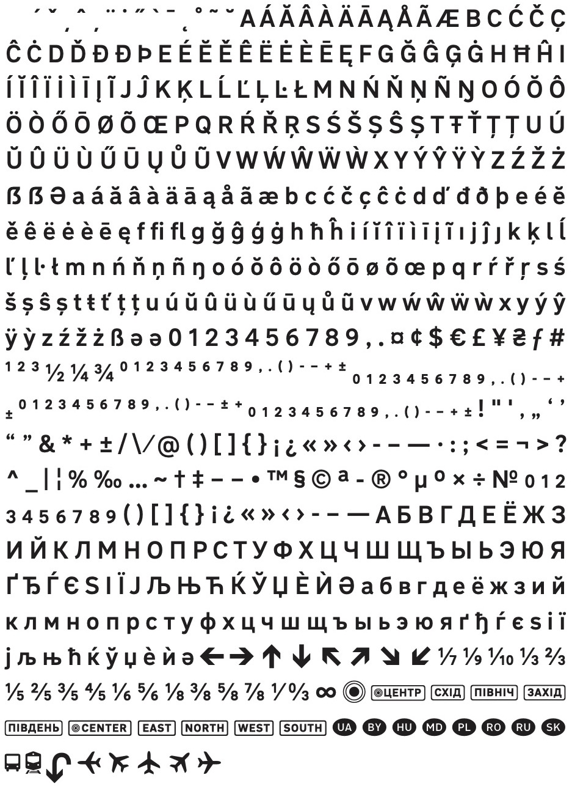

# Додаток А. Cимволи та накреслення шрифта

А.1 Шрифт <a href="https://agentyzmin.github.io/Road-UA-Font/">Road UA</a> містить 623 символа: кирилицю та латинку для назв прикордонних країн.

Ілюcтрація Б.1 — Всі символи шрифта Road UA

<a href="https://github.com/agentyzmin/Road-UA-Font/releases/latest"><button type="button" class="" style="margin-bottom: 2em;">Завантажити шрифт</button></a>

А.2 Шрифт містить вісім накреслень: від надтонкого до наджирнішого. Для знаків використовуються два:
* Medium — для знаків з темним тлом;
* Bold — для знаків зі світлим тлом.

	
RoadUA Thin – 100		  Десь чув, що той фраєр привіз їхньому царю грильяж та класну шубу з пір’я ґави.

	
RoadUA ExtraLight — 200	  На подушечці форми любої є й ґудзик щоб пір’я геть жовте сховати.

	
RoadUA Light — 300		  Факт ґринджол: бій псюг вщух, з’їм шче яєць.

	
RoadUA Regular — 400		  З’їв аґрусу — та ягода цілюща б’є жах інфекцій шипучим «ь».

	
RoadUA Medium — 500		  Щурячий бугай із їжаком-харцизом в’ючись підписали ґешефт у єнах.

	
RoadUA Bold — 700		  Юнкерський джинґл, що при безхліб’ї чує фашист, це ловця гімн.

	
RoadUA ExtraBold — 800	  Фабрикуймо гідність, лящім їжею, ґав хапаймо, з’єднавці чаш!

	
RoadUA Black — 900		  Щастям б’єш жук їх глицю в фон й ґедзь пріч.

А.3 Шрифт містить піктограми у вигляді лігатур (об’єднання послідовність літер в один символ).

<!-- <table>
<thead>
<tr>
<th>Значення</th>
<th>Текст</th>
<th>Лігатура</th>
</tr>
</thead>
<tbody>
<tr>
<td>Символ центру міста</td>
<td><pre>(C), (Ц)</pre></td>
<td>(C)</td>
</tr>
<tr>
<td>Центральний район міста</td>
<td><pre>[ц], [центр]</pre></td>
<td>[ц]</td>
</tr>
<tr>
<td>Східний район</td>
<td><pre>[сх], [схід]</pre></td>
<td>[сх]</td>
</tr>
<tr>
<td>Північний район</td>
<td><pre>[пн], [північ]</pre></td>
<td>[пн]</td>
</tr>
<tr>
<td>Західний район</td>
<td><pre>[зх], [захід]</pre></td>
<td>[зх]</td>
</tr>
<tr>
<td>Південний район</td>
<td><pre>[пд], [південь]</pre></td>
<td>[пд]</td>
</tr>
<tr>
<td>Центральний район міста (англ)</td>
<td><pre>[c], [center]</pre></td>
<td>[c]</td>
</tr>
<tr>
<td>Східний район (англ)</td>
<td><pre>[e], [east]</pre></td>
<td>[e]</td>
</tr>
<tr>
<td>Північний район (англ)</td>
<td><pre>[n], [north]</pre></td>
<td>[n]</td>
</tr>
<tr>
<td>Західний район (англ)</td>
<td><pre>[w], [west]</pre></td>
<td>[w]</td>
</tr>
<tr>
<td>Південний район (англ)</td>
<td><pre>[s], [south]</pre></td>
<td>[s]</td>
</tr>
<tr>
<td>Код України</td>
<td><pre>(UA), (ua)</pre></td>
<td>(UA)</td>
</tr>
<tr>
<td>Код Росії</td>
<td><pre>(RU), (ru)</pre></td>
<td>(RU)</td>
</tr>
<tr>
<td>Код Словаччини</td>
<td><pre>(SK), (sk)</pre></td>
<td>(SK)</td>
</tr>
<tr>
<td>Код Угорщини</td>
<td><pre>(HU), (hu)</pre></td>
<td>(HU)</td>
</tr>
<tr>
<td>Код Польщі</td>
<td><pre>(PL), (pl)</pre></td>
<td>(PL)</td>
</tr>
<tr>
<td>Код Молдови</td>
<td><pre>(MD), (md)</pre></td>
<td>(MD)</td>
</tr>
<tr>
<td>Код Білорусі</td>
<td><pre>(BY), (by)</pre></td>
<td>(BY)</td>
</tr>
<tr>
<td>Код Румунії</td>
<td><pre>(RO), (ro)</pre></td>
<td>(RO)</td>
</tr>
<tr>
<td>Автовокзал, автостанція</td>
<td><pre>(B), (Б)</pre></td>
<td>(B)</td>
</tr>
<tr>
<td>Залізний вокзал та станція</td>
<td><pre>(R), (Ж)</pre></td>
<td>(R)</td>
</tr>
<tr>
<td>Аеропорт (на 9 годин, ліворуч)</td>
<td><pre>(A-9)</pre></td>
<td>(A-9)</td>
</tr>
<tr>
<td>Аеропорт (на 10 та 11 годин)</td>
<td><pre>(А-10), (A-11)</pre></td>
<td>(А-10)</td>
</tr>
<tr>
<td>Аеропорт (на 12 годин, вперед)</td>
<td><pre>(A-12)</pre></td>
<td>(A-12)</td>
</tr>
<tr>
<td>Аеропорт (на 1 та 2 години)</td>
<td><pre>(A-1), (A-2)</pre></td>
<td>(A-1)</td>
</tr>
<tr>
<td>Аеропорт (на 3 години, праворуч)</td>
<td><pre>(A-3)</pre></td>
<td>(A-3)</td>
</tr>
</tbody>
</table>
 -->

| Значення 								| Текст 						| Лігатура 		|
| -----									| ----- 						| -----------	|
| Символ центру міста 					| <pre>(C), (Ц)</pre> 			| (C) 			|
| Центральний район міста 				| <pre>[ц], [центр]</pre> 		| [ц] 			|
| Східний район 						| <pre>[сх], [схід]</pre> 		| [сх] 			|
| Північний район 						| <pre>[пн], [північ]</pre> 	| [пн] 			|
| Західний район 						| <pre>[зх], [захід]</pre> 		| [зх] 			|
| Південний район 						| <pre>[пд], [південь]</pre> 	| [пд] 			|
| Центральний район міста (англ) 		| <pre>[c], [center]</pre> 		| [c] 			|
| Східний район (англ) 					| <pre>[e], [east]</pre> 		| [e] 			|
| Північний район (англ) 				| <pre>[n], [north]</pre> 		| [n] 			| 
| Західний район (англ) 				| <pre>[w], [west]</pre> 		| [w] 			|
| Південний район (англ) 				| <pre>[s], [south]</pre> 		| [s] 			|
| Код України 							| <pre>(UA), (ua)</pre> 		| (UA) 			|
| Код Росії 							| <pre>(RU), (ru)</pre> 		| (RU) 			|
| Код Словаччини 						| <pre>(SK), (sk)</pre> 		| (SK) 			|
| Код Угорщини 							| <pre>(HU), (hu)</pre> 		| (HU) 			|
| Код Польщі 							| <pre>(PL), (pl)</pre> 		| (PL) 			|
| Код Молдови 							| <pre>(MD), (md)</pre> 		| (MD) 			|
| Код Білорусі 							| <pre>(BY), (by)</pre> 		| (BY) 			|
| Код Румунії 							| <pre>(RO), (ro)</pre> 		| (RO) 			|
| Автовокзал, автостанція 				| <pre>(B), (Б)</pre> 			| (B)			|
| Залізний вокзал та станція 			| <pre>(R), (Ж)</pre> 			| (R)			|
| Аеропорт (на 9 годин, ліворуч) 		| <pre>(A-9)</pre>				| (A-9)			|
| Аеропорт (на 10 та 11 годин) 			| <pre>(А-10), (A-11)</pre> 	| (А-10)		|
| Аеропорт (на 12 годин, вперед) 		| <pre>(A-12)</pre>				| (A-12)		|
| Аеропорт (на 1 та 2 години) 			| <pre>(A-1), (A-2)</pre> 		| (A-1) 		|
| Аеропорт (на 3 години, праворуч) 		| <pre>(A-3)</pre>				| (A-3) 		|